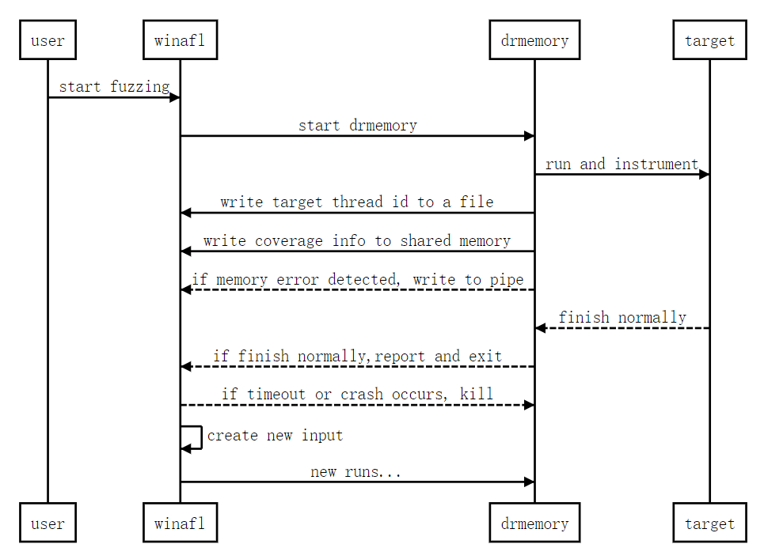

# WDFuzzer Manual

> 中文手册见 [README_CN.md](https://github.com/shijy16/WDFuzzer/blob/master/README_CN.md)
>

##### WDFuzzer：winafl + drmemory

`WDFuzzer` is an A coverage-guided and memory detection abled fuzzer for  for windows software. It's combined with [winafl](https://github.com/googleprojectzero/winafl) and [drmemory](https://github.com/DynamoRIO/drmemory). 

##### Difference from other fuzzers

+ **Application-level Fuzzing**: Most fuzzers on windows are function-level tools, which require users to read the source code of target software or conduct a reverse analysis. As `WDFuzzer` aims at application-level fuzzing, it doesn't require users to understand the target software.
+ **Memory Checking**: `WDFuzzer` implement `drmemory` to conduct a runtime memory checking. This is a optional function as memory checking is time-consuming.

##### Shortcomings

If you want to enable memory checking when fuzzing, you may meet following difficulties:

+ Target software's **debug information is needed**. `Drmemory` only works on software with debug information. Please follow [drmemory's instructions](https://dynamorio.org/drmemory_docs/page_prep.html) to build your target program or prepare its pdb file previously.
+ There might be some false positive when conduct memory check to **GUI** programs with `drmemory`. This is a shortcoming of `drmemory`.

## Quick Start

You can download the release file to start fuzzing directly. A quick start guide is provided in the release file. The quick start guide explains the usage of WDFuzzer by fuzzing a demo.

## Compile WDFuzzer

> You can directly use the release binary of this repo.

`WDFuzzer` is a combination of `winafl` and `drmemory`. The compiling process of `WDFuzzer` is actually the process of compiling `winafl` and `drmemory`. For the detailed compiling instructions, please read their official docs. Only brief and necessary introductions are given here.

##### Environment

+ Install `MS Visual Studio 2017`.
+ Clone this repo.

##### Compile drmemory

In the `x86 command shell` of `MS Visual Studio 2017`, run following commands:

````
cd drmemory
mkdir build32
cd build32
cmake ..
cmake  --build . --config RelWithDebInfo
````

After compiling `drmemory`, the root directory of `dynamorio` will be `drmemory\build32\dynamorio`. 

##### Compile winafl

````
cd winafl
mkdir build32
cd build32
cmake -G"Visual Studio 15 2017" .. -DDynamoRIO_DIR=[directory of Dynamorio]\cmake
cmake --build . --config Release
````

##### Notice

+ The compiling process of `drmemory` takes a long time, and some warnings and errors may occur. This is normal and will not infect the result. Just be patient.
+ If everything goes well, you can get `afl-fuzz.exe` and `winafl.dll` in `winafl\build32\bin\Release`,`drmemory.exe` in `winfuzz\drmemory\build32\bin`.

## Using WDFuzzer

### Command

````
afl-fuzz.exe [afl options] -- [drmemory options] -- [target command line]
````

##### Afl options

(options with`-` must be specified，options with`-` are optional)

````
 -i [dir]        	- input directory with test cases
 -o [dir]			- output directory for fuzzer findings
 -t [msec]			- timeout for each run
 -D [dir]			- directory containing DynamoRIO binaries
 -R [dir]			+ directory containing drmemory binaries
 					if specified, drmemory will be used to conduct runtime memory check
 -O [dir]			+ output directory for target program
 					if target program create files at each run, specify '-O' to clean the output directory
 -N					+ if target program will not stop automatically, '-N' must be used
````

More afl options can be found at [winafl github](https://github.com/googleprojectzero/winafl).

##### `Drmemory` options

(options with`-` must be specified，options with`-` are optional)

````
-coverage_mode [edge|bb]		- coverage calculation mode, edge mode or basic block mode.
-coverage_module [module]		- which modules are concerned, mutiple usage of this options is supported to select mutiple modules.
-no_check_uninitialized 		- donot check uninitialzed errors
								false positive may occur when uninitialzed check is enabled
````

##### Target command line

In target command line, replace the input file with `@@`. If target program creates output files at each run, and the output files should be cleaned. To clean the output directory at each run, please use `-O` option.

### Notice

When `drmemory` starts, it may load the symbol files of system. To guarantee the correctness of fuzzing process, please run target program with `drmemory` previously and confirm it works.  To check run target program with `drmemory` alone, see Example for details.

### Example

Directory structure:

````
-WDFuzzer
	-winafl
		-build32\bin\Release\afl-fuzz.exe
	-drmemory
		-build32\bin\drmemory.exe
		-dynamorio\bin32
	-test
		-in
		-out
		-target_out
		-target.exe
````

Fuzz command:

````
cd WDFuzzer\test

..\winafl\build32\bin\Release\afl-fuzz.exe -i in -o out -t 10000 -D ..\drmemory\build32\dynamorio\bin32 -R ..\drmemory\build32\bin -O target_out -N -- -coverage_module target.exe -coverage_module target_1.dll -coverage_mode edge -- target.exe -out target_out @@
````

If memory checking is not needed in fuzzing process, do not use `-R` and `drmemory` options:

```
..\winafl\build32\bin\Release\afl-fuzz.exe -i in -o out -t 10000 -D [binary directory of Dynamorio] -O target_out -N -- -- target.exe -out target_out @@
```

Run target program with drmemory alone:

````
..\drmemory\build32\bin\drmemory.exe -batch -fuzzer_id any -coverage_module target_1.dll -coverage_mode edge -single -- target.exe -out target_out
````

In this command, `-single` must be used to tell `drmemory`  it is running alone. In order to get system symbols in this step,don't use `-ignore_kernel`. Options must be the same as options used in fuzzing process except `-batch -fuzzer_id any`.

## Implementation

